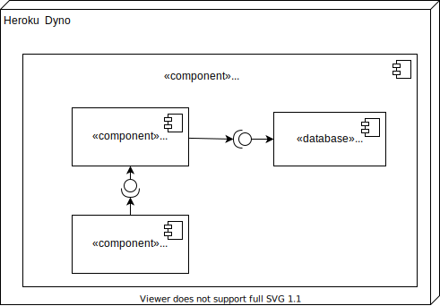

# **Readme**

## **Descripcion de la solución**
API rest for loan management:
- Loan application endpoint
- Retrieve loans endpoint
- Make Payments endpoint
- Check debt endpoint

<br>

**Built with:**

- Java 11
- Spring boot
- JPA
- Gradle 6.8.3

<br>

**Deployed with:**

- Heroku:
  https://meli-loan.herokuapp.com

<br>

**Architecture:**

- Hexagonal Architecture

<br>

## **Diagrams**

### Entity relationship diagram

<br>


<br>

### Deployment diagram

<br>



<br>

## **Test solution**

<br>

**Docker**

- Open command line
- Download docker image
 >  docker pull dianaciro/loan-management

- Run docker image
 > docker run -p 8081:8081 dianaciro/loan-management
- Using postman collection

**Local**

- Install Java 11
- Install Gradle 6.8
- Clone repository https://github.com/dianaCiro/loan-management.git
- Configure IDE with Java 11 and Gradle 6.8
- Import Project from IDE and build/run
- Using postman collection

**Postman**

- [Postman collection](./Loan_application.postman_collection.json)
<br>
- **Variables**

>- {{host}}: https://meli-loan.herokuapp.com o http://localhost:8081
>- {{loanId}}: It could be taken from the endpoint create_loan_application  response.

<br><br>

## **Endpoints**

<br>

**Loan application endpoint**

**URL:** /api/loan

**METHOD:** POST

**BODY**
```json
{
    "amount": 2000,
    "term": 12,
    "rate": 0.05,
    "date": "2019-01-01 14:02Z"
}
```
**RESPONSE**
```json
status code : 200 OK
{
    "installment": 171.21,
    "loan_id": "ddd7b4e2-3072-43fc-ae5c-1d6c6f74227e"
}
```
<br><br>

**Retrieve loans endpoint**

**URL:** /api/loan

**METHOD:** GET

**PARAMS:**

>**from (query param) :** 
>- *type:* date, format "yyyy-MM-dd HH:mm'Z'" (ISO 8601) 
>- *required:* false
>- *description:* It indicates the initial date to filter loans
>- *example:* 2017-01-01 14:00Z

>**to (query param) :** 
>- *type:* date, format "yyyy-MM-dd HH:mm'Z'" (ISO 8601) 
>- *required:* false
>- *description:* It indicates the final date to filter loans
>- *example:* 2020-01-01 14:00Z

>**page (query param) :** 
>- *type:* integer  
>- *required:* false
>- *description:* page to retrieve data, zero based page index (0... N)
>- *example:* 1
>- *default value:*: 0

>**limit (query param) :** 
>- *type:* integer  
>- *required:* false
>- *description:* the size of the page to be returned
>- *example:* 15
>- *default value:*: 5

>**sortColumn (query param) :** 
>- *type:* string  
>- *required:* false
>- *description:* name of the data atrribute to sort
>- *example:* date

>**sortDirection (query param) :** 
>- *type:* string  
>- *required:* false
>- *description:* sort direction (ASC or DESC)
>- *example:* ASC

**RESPONSE**

```json
status code : 200 OK
{
    "loans": [
        {
            "id": "ddd7b4e2-3072-43fc-ae5c-1d6c6f74227e",
            "amount": 2000.0,
            "term": 12,
            "rate": 0.05,
            "date": "2019-01-01 14:02Z"
        }
    ],
    "totalPages": 1,
    "totalElements": 1
}
```

<br><br>

**Make Payments endpoint**

<br>

**URL:** /api/loan/{id}/payment

**METHOD:** POST

**PARAMS:**
>**id (path param) :** 
>- *type:* string  
>- *required:* true
>- *description:* loan id (UUID)
>- *example:* 58efb564-0928-4294-8ef6-e4eeb702fd89

**BODY**
```json
{
    "paymentType": "made",
    "date": "2021-09-05 02:18Z",
    "amount": 85.60
}
```
**RESPONSE**
```json
status code : 200 OK
{
    "id": 1,
    "loanId": "58efb564-0928-4294-8ef6-e4eeb702fd89",
    "paymentType": "made",
    "date": "2021-09-05 02:18Z",
    "amount": 85.6
}
```
<br><br>

**Check debt endpoint**

**URL:** /api/loan/{id}/debt

**METHOD:** GET

**PARAMS:**

>**id (path param) :** 
>- *type:* string  
>- *required:* true
>- *description:* loan id (UUID)
>- *example:* 58efb564-0928-4294-8ef6-e4eeb702fd89

>**to (query param) :** 
>- *type:* date, format "yyyy-MM-dd HH:mm'Z'" (ISO 8601) 
>- *required:* false
>- *description:* It indicates date to filter the loan payments.
>- *example:* 2020-01-01 14:00Z

**RESPONSE**

```json
status code : 200 OK
{
    "balance": 1754.52
}
```